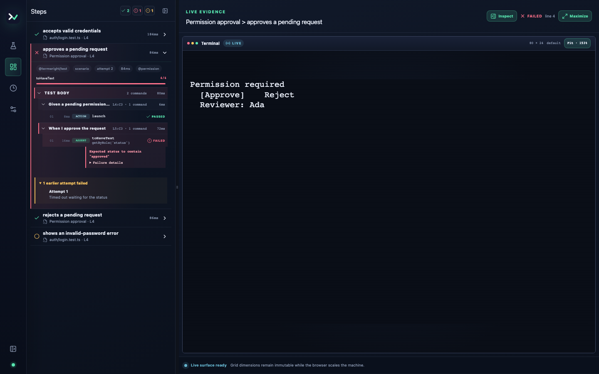

# Termwright

<p align="center">
  
</p>

Test interactive command-line applications through a real terminal.

Termwright starts your program in a pseudoterminal, sends keyboard and mouse
input, and asserts the rendered terminal screen. When a test fails, it keeps a
trace you can replay in the desktop Runner.

[](https://github.com/Gorce-AI/termwright/actions/workflows/ci.yml)
[](https://gorce-ai.github.io/termwright/)
[](https://www.npmjs.com/package/termwright)
[](LICENSE)

## Install

Termwright supports Node.js 22 and 24 on macOS 13.5+ (x64/arm64), Windows 10
1809+ or Server 2019+ (x64/arm64), and glibc 2.35+ Linux (x64/arm64).

```sh
npm install --save-dev termwright
```

## Write a test

```ts
import { fileURLToPath } from 'node:url';
import { expect, test } from 'termwright/test';

const program = fileURLToPath(new URL('../app.js', import.meta.url));

test('approves a command', async ({ terminal }) => {
  const app = await terminal.launch({ command: [process.execPath, program] });

  await app.waitForText('Permission required');
  await app.press('Enter');

  await expect(app).toHaveText('running: ls -la');
});
```

Run it with Termwright's test command:

```sh
npx termwright test
```

This test needs no Termwright code in the application. It observes the terminal
screen and sends the same key sequence as a user.

Framework integrations for Ink, OpenTUI, Textual, tview, Bubble Tea, and Ratatui
can add roles, labels, and state. Visibility and pointer support vary by
framework. After [enabling an integration](https://gorce-ai.github.io/termwright/adapters/):

```ts
const approve = app.getByRole('button', { name: 'Approve' });
await expect(approve).toBeAttached();
// Continue the application's keyboard workflow through the terminal.
await app.press('Enter');
await expect(app.getByRole('status')).toHaveText('Approved');
```

Termwright only uses roles and pointer targets reported by the integration. It
does not guess them from decorated terminal text.

## Inspect a failure

```sh
npx termwright ui
```

The Runner shows the terminal, application logs, semantic state, and test steps
from the failed attempt.



## Documentation

- [Get started](https://gorce-ai.github.io/termwright/getting-started/)
- [Write tests](https://gorce-ai.github.io/termwright/writing-tests/)
- [Choose locators](https://gorce-ai.github.io/termwright/guides/locators/)
- [Debug a failing test](https://gorce-ai.github.io/termwright/tools/debugging/)
- [Framework integrations](https://gorce-ai.github.io/termwright/adapters/)
- [Supported platforms and limitations](https://gorce-ai.github.io/termwright/reference/limitations/)
- [API reference](https://gorce-ai.github.io/termwright/reference/test-api/)

Runnable projects for JavaScript, Ink, OpenTUI, Textual, tview, Bubble Tea, and
Ratatui are in [`examples/`](examples).

## Contributing

Termwright is an MIT-licensed open-source project. Read
[`CONTRIBUTING.md`](CONTRIBUTING.md) before changing the repository.

## License

[MIT](LICENSE) © gorce-ai
